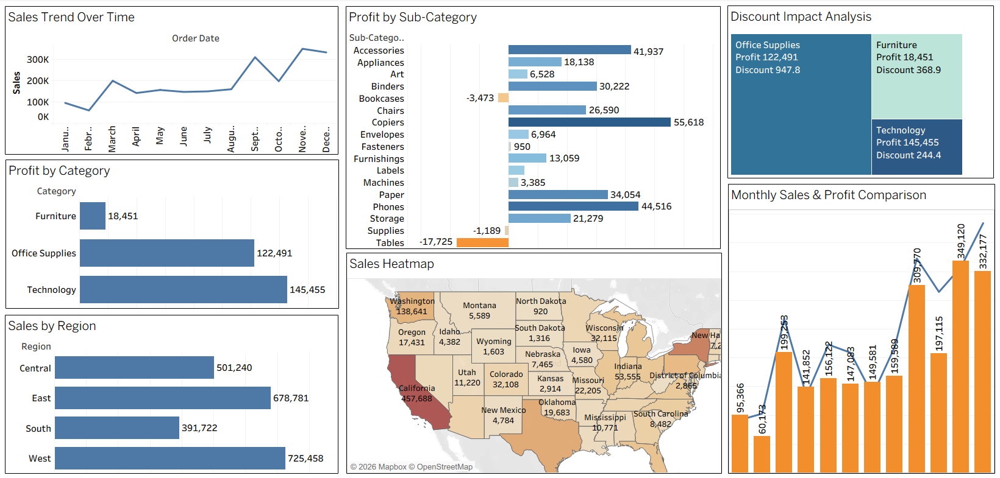

# 📊 Superstore Sales & Profit Analysis – Tableau

## 📌 Project Overview
This project analyzes retail sales performance using Tableau. 
The objective was to identify revenue trends, profit drivers, and loss-making segments.

## 🎯 Business Objectives
- Analyze sales and profit trends over time
- Identify top-performing categories and regions
- Understand impact of discount on profitability
- Detect loss-making sub-categories

## 🛠 Tools Used
- Tableau
- CSV Dataset

## 📈 Key Insights
- Technology category generated highest profit.
- Furniture category showed low profit margin despite high sales.
- Higher discounts significantly reduced profitability.
- West region contributed highest sales.

## 📂 Project Files
- Dataset
- Dashboard screenshot
- Insights documentation

## Dashboard Preview

